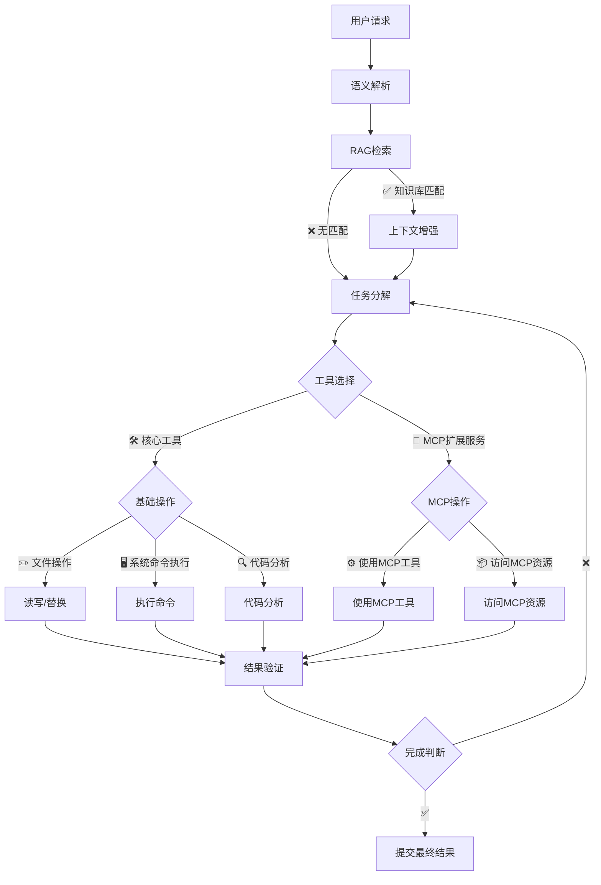
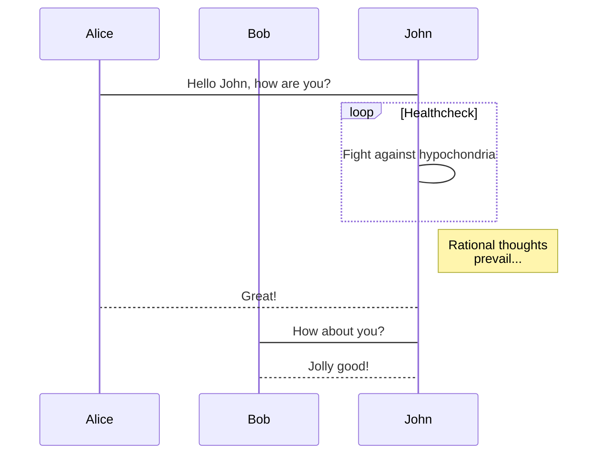
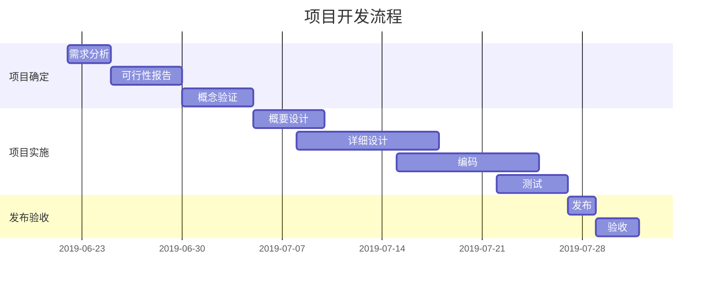

### Swift

```swift
import UIKit

final class MarkdownViewController: UIViewController {

    private let markdownView = MarkdownView()

    override func viewDidLoad() {
        super.viewDidLoad()

        view.backgroundColor = .white
        view.addSubview(markdownView)

        markdownView.frame = view.bounds
    }

    func render(markdown: String) {
        markdownView.render(markdown)
    }
}
```


### 8. 绘制表格

| 作品名称        | 在线地址   |  上线日期  |
| :--------  | :-----  | :----:  |
| 逍遥自在轩 | [https://www.niceshare.site](https://www.niceshare.site/?ref=markdown.lovejade.cn) |2024-04-26|
| 玉桃文飨轩 | [https://share.lovejade.cn](https://share.lovejade.cn/?ref=markdown.lovejade.cn) |2022-08-26|
| 缘知随心庭 | [https://fine.niceshare.site](https://fine.niceshare.site/?ref=markdown.lovejade.cn) |2022-02-26|
| 静轩之别苑 | [http://quickapp.lovejade.cn](http://quickapp.lovejade.cn/?ref=markdown.lovejade.cn) |2019-01-12|
| 晚晴幽草轩 | [https://www.jeffjade.com](https://www.jeffjade.com/?ref=markdown.lovejade.cn) |2014-09-20|
| 缘知随心庭 | [https://fine.niceshare.site](https://fine.niceshare.site/?ref=markdown.lovejade.cn) |2022-02-26|
| 静轩之别苑 | [http://quickapp.lovejade.cn](http://quickapp.lovejade.cn/?ref=markdown.lovejade.cn) |2019-01-12|
| 晚晴幽草轩 | [https://www.jeffjade.com](https://www.jeffjade.com/?ref=markdown.lovejade.cn) |2014-09-20|
| 缘知随心庭 | [https://fine.niceshare.site](https://fine.niceshare.site/?ref=markdown.lovejade.cn) |2022-02-26|
| 静轩之别苑 | [http://quickapp.lovejade.cn](http://quickapp.lovejade.cn/?ref=markdown.lovejade.cn) |2019-01-12|
| 晚晴幽草轩 | [https://www.jeffjade.com](https://www.jeffjade.com/?ref=markdown.lovejade.cn) |2014-09-20|

---

# Markdown 综合测试文档

这是一段用于测试 Markdown 渲染效果的文本。Markdown 可以同时包含**粗体**、*斜体*、~~删除线~~、`行内代码`以及 [链接](https://example.com)。

<audio src="xxx.mp3" />


<video src="xxx.mp4" />

---

## 一、基本文本

Markdown 是一种轻量级标记语言，可以使用简单的符号来组织文章结构。

这是一段比较长的文本，用来测试连续文字在不同宽度的容器中是否能够正常换行。对于移动端来说，文本长度、字体大小、行间距以及容器宽度都会影响最终的排版效果。

你也可以使用 **粗体文本**、*斜体文本*、***粗斜体文本*** 和 ~~删除文本~~。

---

## 二、标题层级

# 一级标题

## 二级标题

### 三级标题

#### 四级标题

##### 五级标题

###### 六级标题

标题下面可以继续跟随正文内容，用于测试标题与正文之间的间距。

---

## 三、列表

### 无序列表

- 苹果
- 香蕉
- 橙子
- 西瓜
- 葡萄

### 嵌套列表

- 水果
  - 苹果
  - 香蕉
  - 橙子
- 蔬菜
  - 西红柿
  - 黄瓜
  - 胡萝卜
- 肉类
  - 牛肉
  - 猪肉
  - 鸡肉

### 有序列表

1. 第一步：准备数据
2. 第二步：解析 Markdown
3. 第三步：生成 AttributedString
4. 第四步：插入自定义 View
5. 第五步：刷新 UI

---

## 四、引用

> Markdown 可以非常方便地表示引用内容。

> 这是一段比较长的引用文本，用于测试多行引用的显示效果。
> 如果引用内容超过当前容器宽度，就应该自动换行。

---

## 五、任务列表

- [x] 初始化项目
- [x] 实现 Markdown Parser
- [x] 支持代码块
- [x] 支持表格
- [ ] 支持 Mermaid
- [ ] 支持 ECharts
- [ ] 优化流式解析性能

---

## 六、代码

### Swift

```swift
import UIKit

final class MarkdownViewController: UIViewController {

    private let markdownView = MarkdownView()

    override func viewDidLoad() {
        super.viewDidLoad()

        view.backgroundColor = .white
        view.addSubview(markdownView)

        markdownView.frame = view.bounds
    }

    func render(markdown: String) {
        markdownView.render(markdown)
    }
}
```


# SVG 图片测试

## 1. 内联 SVG（圆形 + 渐变）

<svg width="200" height="120" viewBox="0 0 200 120" xmlns="http://www.w3.org/2000/svg">
  <defs>
    <linearGradient id="g1" x1="0%" y1="0%" x2="100%" y2="100%">
      <stop offset="0%" stop-color="#4facfe"/>
      <stop offset="100%" stop-color="#00f2fe"/>
    </linearGradient>
  </defs>
  <rect x="0" y="0" width="200" height="120" rx="12" fill="url(#g1)"/>
  <circle cx="60" cy="60" r="35" fill="#ffffff" fill-opacity="0.85"/>
  <text x="110" y="66" font-size="16" fill="#ffffff">Inline SVG</text>
</svg>

## 2. 内联 SVG（折线图）

<svg width="240" height="140" viewBox="0 0 240 140" xmlns="http://www.w3.org/2000/svg">
  <rect width="240" height="140" fill="#fafafa" stroke="#e0e0e0"/>
  <polyline points="20,120 60,80 100,95 140,45 180,60 220,20"
            fill="none" stroke="#ef4136" stroke-width="3"/>
  <line x1="20" y1="120" x2="220" y2="120" stroke="#999" stroke-width="1"/>
  <line x1="20" y1="20" x2="20" y2="120" stroke="#999" stroke-width="1"/>
</svg>

## 3. 内联 SVG（星星图标）

<svg width="80" height="80" viewBox="0 0 24 24" xmlns="http://www.w3.org/2000/svg">
  <path d="M12 2l2.9 6.3 6.9.8-5.1 4.7 1.4 6.8L12 17.3 5.9 20.6l1.4-6.8L2.2 9.1l6.9-.8z"
        fill="#FFC107" stroke="#F57C00" stroke-width="0.5"/>
</svg>

## 4. HTML img 引用远程 SVG


## 5. Markdown 语法引用远程 SVG


## 6. Base64 Data URI 的 SVG


行内也可以混排一个小图标 <svg width="16" height="16" viewBox="0 0 16 16" xmlns="http://www.w3.org/2000/svg"><circle cx="8" cy="8" r="7" fill="#2196F3"/></svg> 这样。

---


| 姓名 | 年龄 | 城市 |
|---|---:|---|
| 张三 | 28 | 深圳 |
| 李四 | 30 | 广州 |
| 王五 | 25 | 上海 |

| 姓名 | 年龄 | 城市 |
|---|---:|---|
| 张三 | 28 | 深圳 |
| 李四 | 30 | 广州 |
| 王五 | 25 | 上海 |

```swift
let name = "Jack"
let age = 18

print("Hello, \(name)")
print("Age: \(age)")
```

<!--| 姓名 | 年龄 | 城市 |-->
<!--|---|---:|---|-->
<!--| 张三 | 28 | 深圳 |-->
<!--| 李四 | 30 | 广州 |-->
<!--| 王五 | 25 | 上海 |-->
<!---->
<!---->
<!--| 姓名 | 年龄 | 城市 |-->
<!--|---|---:|---|-->
<!--| 张三 | 28 | 深圳 |-->
<!--| 李四 | 30 | 广州 |-->
<!--| 王五 | 25 | 上海 |-->

kak <video src="https://www.w3schools.com/html/mov_bbb.mp4" type="video/mp4"> dasadfasdf
11111<audio src="https://www.w3schools.com/html/horse.mp3" controls>3333
<br>
<video src="https://www.w3schools.com/html/mov_bbb.mp4" type="video/mp4">
<br>
<audio src="https://www.w3schools.com/html/horse.mp3" controls>
<br>
点击 <a href="https://example.com">这里</a> 查看详情。

这是 **加粗**，也是 <span style="color:red">红色文字</span>。

点击 <a href="https://example.com">这里</a> 查看详情。

这是 <u>下划线</u> 和 <del>删除线</del>。

这是 <code>inline code</code>。

这是  图片。

kak <video src="https://www.w3schools.com/html/mov_bbb.mp4" type="video/mp4"> dasadfasdf


# 下面展示WebView渲染

<body>
    <h1>Hello HTML</h1>
    <p>
        这是一段
        <span class="highlight">HTML 测试文本</span>。
    </p>
    <div class="card">
        <h2>测试内容</h2>
        <p>这里可以测试 WebView 的 HTML 渲染效果。</p>
        <ul>
            <li>第一项</li>
            <li>第二项</li>
            <li>第三项</li>
        </ul>
    </div>
    <button onclick="showMessage()">
        点击测试
    </button>
    <video controls>
        <source src="https://www.w3schools.com/html/mov_bbb.mp4" type="video/mp4">
        Your browser does not support the video tag.
    </video>
    <script>
        function showMessage() {
            alert("Hello from JavaScript!");
        }
    </script>
</body>


调用 `viewDidLoad() @某人 ` 方法。

$$\\frac{-b \\pm \\sqrt{b^2 - 4ac}}{2a}$$@某人3 ¥333

@某人 @某人3 @某人3


<body>
    <h1>Hello HTML</h1>
    <p>
        这是一段
        <span class="highlight">HTML 测试文本</span>。
    </p>
    <div class="card">
        <h2>测试内容</h2>
        <p>这里可以测试 WebView 的 HTML 渲染效果。</p>
        <ul>
            <li>第一项</li>
            <li>第二项</li>
            <li>第三项</li>
        </ul>
    </div>
    <button onclick="showMessage()">
        点击测试
    </button>
    <script>
        function showMessage() {
            alert("Hello from JavaScript!");
        }
    </script>
</body>

调用 `viewDidLoad() @某人 ` 方法。

$$\\frac{-b \\pm \\sqrt{b^2 - 4ac}}{2a}$$@某人3 ¥333

@某人 @某人3 @某人3

@某人 @某人3 @某人3¥3333

```swift
    func stopDisplayLink() {
        displayLink.stop()
    }
```

### 2. 书写一个质能守恒公式[^LaTeX] 

---
# 一、公式测试

## 1.1 二次方程公式

$$\\frac{-b \\pm \\sqrt{b^2 - 4ac}}{2a}$$

## 1.2 高斯积分

$$\\int_{0}^{\\infty} e^{-x^2} dx = \\frac{\\sqrt{\\pi}}{2}$$


下面是 2025 年各季度销售额： 

```echarts
{
  "title": {
    "text": "2025 年季度销售额"
  },
  "tooltip": {
    "trigger": "axis"
  },
  "xAxis": {
    "type": "category",
    "data": ["Q1", "Q2", "Q3", "Q4"]
  },
  "yAxis": {
    "type": "value"
  },
  "series": [
    {
      "name": "销售额",
      "type": "bar",
      "data": [120, 200, 150, 280]
    }
  ]
}
```





# 欢迎使用 `Arya` 在线 Markdown 编辑器

 - Emoji: 😀 🎉 🚀 ✅ ❌ ⚠️ 💡 🔥
 
 

### 4. 高效绘制[流程图](https://github.com/knsv/mermaid#flowchart)e\u{301}
    👨\u{200D}👩\u{200D}👧\u{200D}👦
    odododo


```swift
    func stopDisplayLink() {
        displayLink.stop()
    }
    func pauseDisplayLink() {
        displayLink.pause()
    }
    func startDisplayLink() {
        displayLink.start()
    }
```


[Arya](https://markdown.lovejade.cn/?ref=markdown.lovejade.cn)，是一款基于 `Vue`、`Vditor`，为未来而构建的在线 Markdown 编辑器；轻量且强大：内置粘贴 HTML 自动转换为 Markdown，支持流程图、甘特图、时序图、任务列表，可导出携带样式的图片、PDF、微信公众号特制的 HTML 等等。

### 8. 绘制表格

| 作品名称        | 在线地址   |  上线日期  |
| :--------  | :-----  | :----:  |
| 逍遥自在轩 | [https://www.niceshare.site](https://www.niceshare.site/?ref=markdown.lovejade.cn) |2024-04-26|
| 玉桃文飨轩 | [https://share.lovejade.cn](https://share.lovejade.cn/?ref=markdown.lovejade.cn) |2022-08-26|
| 缘知随心庭 | [https://fine.niceshare.site](https://fine.niceshare.site/?ref=markdown.lovejade.cn) |2022-02-26|
| 静轩之别苑 | [http://quickapp.lovejade.cn](http://quickapp.lovejade.cn/?ref=markdown.lovejade.cn) |2019-01-12|
| 晚晴幽草轩 | [https://www.jeffjade.com](https://www.jeffjade.com/?ref=markdown.lovejade.cn) |2014-09-20|
| 缘知随心庭 | [https://fine.niceshare.site](https://fine.niceshare.site/?ref=markdown.lovejade.cn) |2022-02-26|
| 静轩之别苑 | [http://quickapp.lovejade.cn](http://quickapp.lovejade.cn/?ref=markdown.lovejade.cn) |2019-01-12|
| 晚晴幽草轩 | [https://www.jeffjade.com](https://www.jeffjade.com/?ref=markdown.lovejade.cn) |2014-09-20|
| 缘知随心庭 | [https://fine.niceshare.site](https://fine.niceshare.site/?ref=markdown.lovejade.cn) |2022-02-26|
| 静轩之别苑 | [http://quickapp.lovejade.cn](http://quickapp.lovejade.cn/?ref=markdown.lovejade.cn) |2019-01-12|
| 晚晴幽草轩 | [https://www.jeffjade.com](https://www.jeffjade.com/?ref=markdown.lovejade.cn) |2014-09-20|

---

[video:https://github.com/user-attachments/assets/f5de75f6-135a-4ab4-9f5f-079f649764d5]
### 音乐1
[music:https://img2.tukuppt.com/newpreview_music/09/00/90/5c89a8c2d9ace90125.mp3]
### 音乐2
[music:https://img2.tukuppt.com/newpreview_music/09/00/90/5c89a8c2d9ace90125.mp3]
### 音乐3
[music:https://img2.tukuppt.com/newpreview_music/09/00/90/5c89a8c2d9ace90125.mp3]

## 如何使用

**微注**：清空目前这份默认文档，即处于可使用态。[Arya](https://markdown.lovejade.cn/?ref=markdown.lovejade.cn) 另一大优点在于：编辑内容只会在您本地进行保存，不会上传您的数据至服务器，**绝不窥测用户个人隐私，可放心使用**；Github 源码：[markdown-online-editor](https://github.com/nicejade/markdown-online-editor)，部分功能仍在开发🚧，敬请期待。

默认为[所见即所得](https://hacpai.com/article/1577370404903?ref=github.com)模式，可通过 `⌘-⇧-M`（`Ctrl-⇧-M`）进行切换；或通过以下方式：

- 所见即所得：`⌘-⌥-7`（`Ctrl-alt-7`）；
- 即时渲染：`⌘-⌥-8`（`Ctrl-alt-8`）；
- 分屏渲染：`⌘-⌥-9`（`Ctrl-alt-9`）；

### PPT 预览

如果您用作 `PPT` 预览（入口在`设置`中），需要注意，这里暂还不能支持各种图表的渲染；您可以使用 `---` 来定义水平方向上幻灯片，用 `--` 来定义垂直幻灯片；更多设定可以参见 [RevealJs 文档](https://github.com/hakimel/reveal.js#table-of-contents)。

---

## 什么是 Markdown

`Markdown` 是一种方便记忆、书写的纯文本标记语言，用户可以使用这些标记符号，以最小的输入代价，生成极富表现力的文档：譬如您正在阅读的这份文档。它使用简单的符号标记不同的标题，分割不同的段落，**粗体**、*斜体* 或者[超文本链接](https://vue-cli3.lovejade.cn/explore/)，更棒的是，它还可以：

---

### 1. 制作待办事宜 `Todo` 列表

- [x] 🎉 通常 `Markdown` 解析器自带的基本功能；
- [x] 🍀 支持**流程图**、**甘特图**、**时序图**、**任务列表**；
- [x] 🏁 支持粘贴 HTML 自动转换为 Markdown；
- [x] 💃🏻 支持插入原生 Emoji、设置常用表情列表；
- [x] 🚑 支持编辑内容保存**本地存储**，防止意外丢失；
- [x] 📝 支持**实时预览**，主窗口大小拖拽，字符计数；
- [x] 🛠 支持常用快捷键(**Tab**)，及代码块添加复制
- [x] ✨ 支持**导出**携带样式的 PDF、PNG、JPEG 等；
- [x] ✨ 升级 Vditor，新增对 `echarts` 图表的支持；
- [x] 👏 支持检查并格式化 Markdown 语法，使其专业；
- [x] 🦑 支持五线谱、及[部分站点、视频、音频解析](https://github.com/b3log/vditor/issues/117?ref=hacpai.com#issuecomment-526986052)；
- [x] 🌟 增加对**所见即所得**编辑模式的支持(`⌘-⇧-M`)；

---

# Markdown 图文混排示例图文混排示例

欢迎使用 Markdown 图文混排演示。

这是一段普通文本。


图片展示了一幅美丽的自然风景。

## 产品介绍

下面展示一款产品：


- 高清显示
- 超长续航
- 轻薄设计


### 2. 书写一个质能守恒公式[^LaTeX]

$$
E=mc^2
$$

---
# 一、公式测试

## 1.1 二次方程公式

$$\\frac{-b \\pm \\sqrt{b^2 - 4ac}}{2a}$$

## 1.2 高斯积分

$$\\int_{0}^{\\infty} e^{-x^2} dx = \\frac{\\sqrt{\\pi}}{2}$$

## 1.3 矩阵 (bmatrix)

$$\\begin{bmatrix} 1 & x & x^2 \\\\\\\\ 0 & 1 & 2x \\\\\\\\ 0 & 0 & 2 \\end{bmatrix}$$

## 1.4 嵌套混合

$$f(x) = \\begin{pmatrix} \\frac{1}{2} & \\sqrt{x} \\\\\\\\ \\alpha & \\beta \\end{pmatrix}$$


## 1.8 定积分

$$\\int_{a}^{b} f(x) dx$$


### 3. 高亮一段代码[^code]

```swift
    func stopDisplayLink() {
        displayLink.stop()
    }
    func pauseDisplayLink() {
        displayLink.pause()
    }
    func startDisplayLink() {
        displayLink.start()
    }
    private func resetBuffer() {
        stopDisplayLink()
      
    }
 
```


---

### 4. 高效绘制[流程图](https://github.com/knsv/mermaid#flowchart)


---

### 5. 高效绘制[序列图](https://github.com/knsv/mermaid#sequence-diagram)



---

### 6. 高效绘制[甘特图](https://github.com/knsv/mermaid#gantt-diagram)

> **甘特图**内在思想简单。基本是一条线条图，横轴表示时间，纵轴表示活动（项目），线条表示在整个期间上计划和实际的活动完成情况。它直观地表明任务计划在什么时候进行，及实际进展与计划要求的对比。



### 7. 支持图表

```echarts
{
  "backgroundColor": "#212121",
  "title": {
    "text": "「晚晴幽草轩」访问来源",
    "subtext": "2019 年 6 月份",
    "x": "center",
    "textStyle": {
      "color": "#f2f2f2"
    }
  },
  "tooltip": {
    "trigger": "item",
    "formatter": "{a} <br/>{b} : {c} ({d}%)"
  },
  "legend": {
    "orient": "vertical",
    "left": "left",
    "data": [
      "搜索引擎",
      "直接访问",
      "推荐",
      "其他",
      "社交平台"
    ],
    "textStyle": {
      "color": "#f2f2f2"
    }
  },
  "series": [
    {
      "name": "访问来源",
      "type": "pie",
      "radius": "55%",
      "center": [
        "50%",
        "60%"
      ],
      "data": [
        {
          "value": 10440,
          "name": "搜索引擎",
          "itemStyle": {
            "color": "#ef4136"
          }
        },
        {
          "value": 4770,
          "name": "直接访问"
        },
        {
          "value": 2430,
          "name": "推荐"
        },
        {
          "value": 342,
          "name": "其他"
        },
        {
          "value": 18,
          "name": "社交平台"
        }
      ],
      "itemStyle": {
        "emphasis": {
          "shadowBlur": 10,
          "shadowOffsetX": 0,
          "shadowColor": "rgba(0, 0, 0, 0.5)"
        }
      }
    }
  ]
}
```

下面是 2025 年各季度销售额：

```echarts
{
  "title": {
    "text": "2025 年季度销售额"
  },
  "tooltip": {
    "trigger": "axis"
  },
  "xAxis": {
    "type": "category",
    "data": ["Q1", "Q2", "Q3", "Q4"]
  },
  "yAxis": {
    "type": "value"
  },
  "series": [
    {
      "name": "销售额",
      "type": "bar",
      "data": [120, 200, 150, 280]
    }
  ]
}
```

> **备注**：上述 echarts 图表📈，其数据，须使用严格的 **JSON** 格式；您可使用 JSON.stringify(data)，将对象传换从而得标准数据，即可正常使用。

---

### 8. 绘制表格

| 作品名称        | 在线地址   |  上线日期  |
| :--------  | :-----  | :----:  |
| 逍遥自在轩 | [https://www.niceshare.site](https://www.niceshare.site/?ref=markdown.lovejade.cn) |2024-04-26|
| 玉桃文飨轩 | [https://share.lovejade.cn](https://share.lovejade.cn/?ref=markdown.lovejade.cn) |2022-08-26|
| 缘知随心庭 | [https://fine.niceshare.site](https://fine.niceshare.site/?ref=markdown.lovejade.cn) |2022-02-26|
| 静轩之别苑 | [http://quickapp.lovejade.cn](http://quickapp.lovejade.cn/?ref=markdown.lovejade.cn) |2019-01-12|
| 晚晴幽草轩 | [https://www.jeffjade.com](https://www.jeffjade.com/?ref=markdown.lovejade.cn) |2014-09-20|
| 缘知随心庭 | [https://fine.niceshare.site](https://fine.niceshare.site/?ref=markdown.lovejade.cn) |2022-02-26|
| 静轩之别苑 | [http://quickapp.lovejade.cn](http://quickapp.lovejade.cn/?ref=markdown.lovejade.cn) |2019-01-12|
| 晚晴幽草轩 | [https://www.jeffjade.com](https://www.jeffjade.com/?ref=markdown.lovejade.cn) |2014-09-20|
| 缘知随心庭 | [https://fine.niceshare.site](https://fine.niceshare.site/?ref=markdown.lovejade.cn) |2022-02-26|
| 静轩之别苑 | [http://quickapp.lovejade.cn](http://quickapp.lovejade.cn/?ref=markdown.lovejade.cn) |2019-01-12|
| 晚晴幽草轩 | [https://www.jeffjade.com](https://www.jeffjade.com/?ref=markdown.lovejade.cn) |2014-09-20|

---

### 9. 更详细语法说明

想要查看更详细的语法说明，可以参考这份 [Markdown 资源列表](https://github.com/nicejade/nice-front-end-tutorial/blob/master/tutorial/markdown-tutorial.md)，涵盖入门至进阶教程，以及资源、平台等信息，能让您对她有更深的认知。

总而言之，不同于其它**所见即所得**的编辑器：你只需使用键盘专注于书写文本内容，就可以生成印刷级的排版格式，省却在键盘和工具栏之间来回切换，调整内容和格式的麻烦。**Markdown 在流畅的书写和印刷级的阅读体验之间找到了平衡。** 目前它已经成为世界上最大的技术分享网站 `GitHub` 和 技术问答网站 `StackOverFlow` 的御用书写格式，而且越发流行，正在在向各行业渗透。

最新更新于 2025.04.16


```sequence
Alice->Bob: Hello Bob, how are you?
Note right of Bob: Bob thinks
Bob-->Alice: I am good thanks!
```

```flow
st=>start: 开始
op=>operation: 执行操作
cond=>condition: 是否成功?
e=>end: 结束

st->op->cond
cond(yes)->e
cond(no)->op
```


:smile:


- [ ] 这是一个任务列表项
- [ ] 需要在前面使用列表的语法
- [ ] normal **formatting**, @mentions, #1234 refs
- [ ] 未完成
- [ ] 完成


<!-- I am some comments
not end, not end...
here the comment ends -->


<audio src="xxx.mp3" />


<video src="xxx.mp4" />
