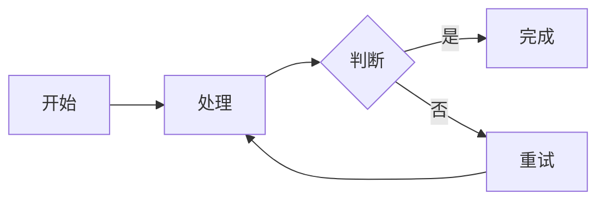
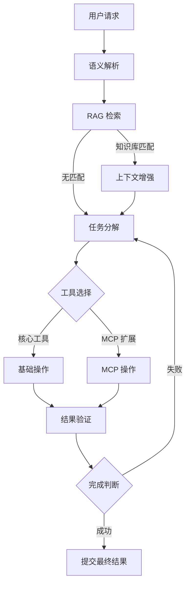
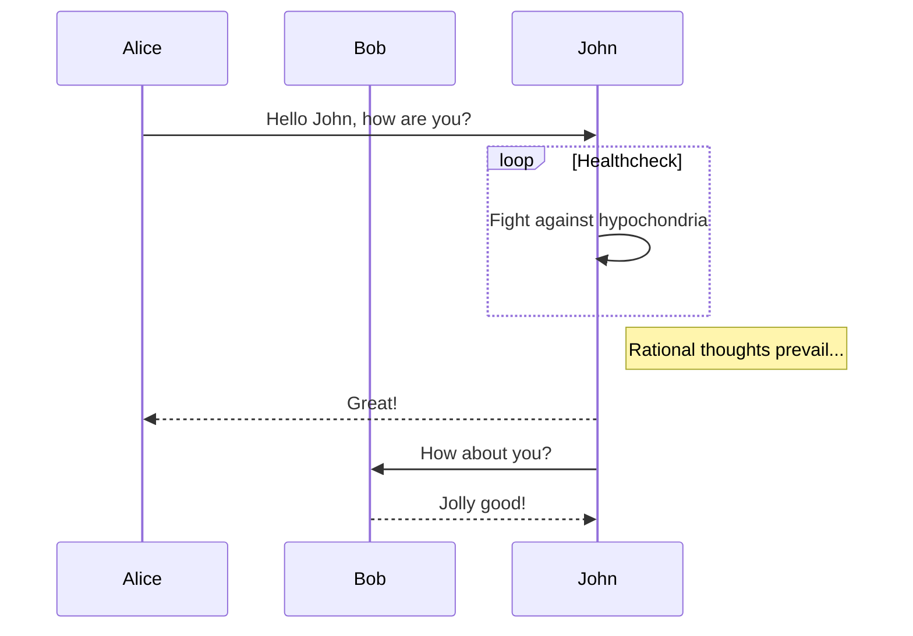
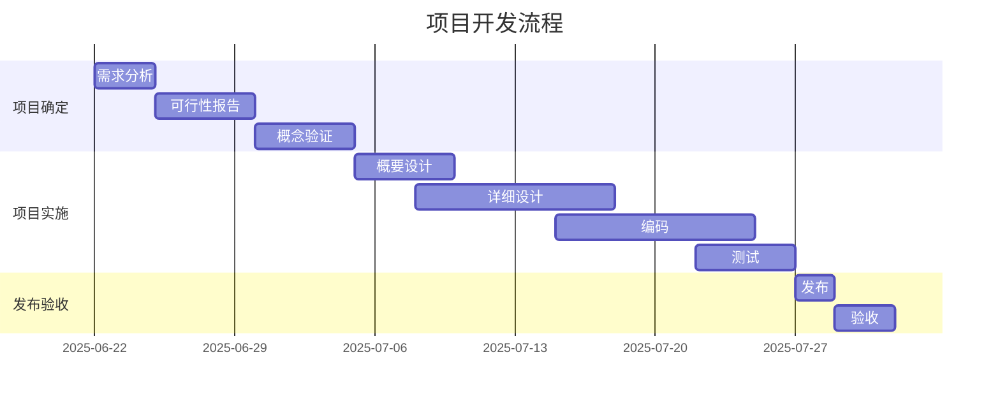
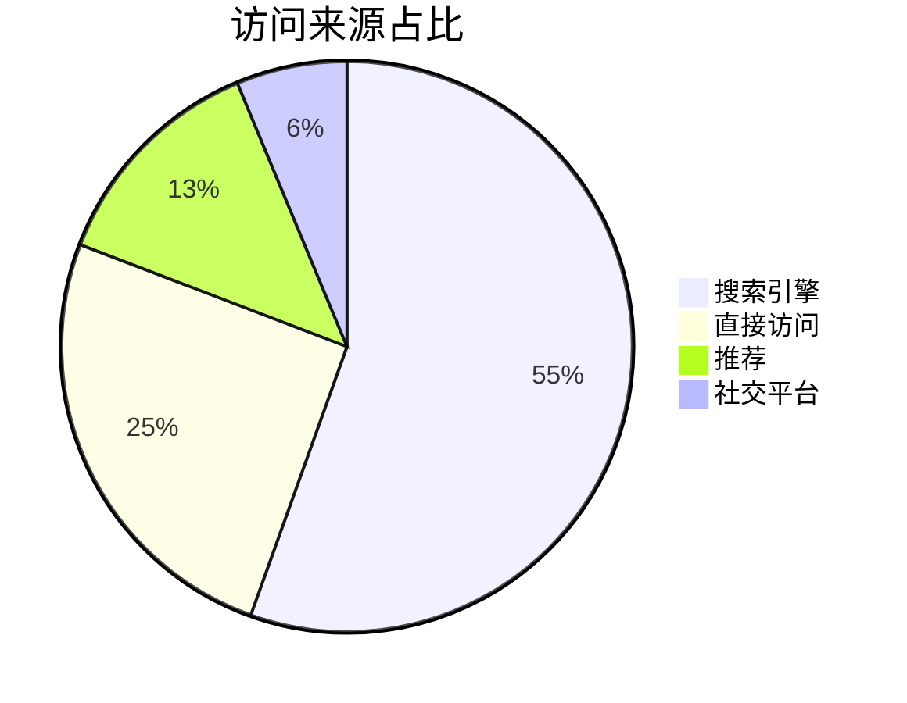

# Markdown 全格式综合测试文档Markdown 全格式综合测试文档Markdown 全格式综合测试文档

### 块级公式1

$$E = mc^2$$

### 二次方程求根公式

$$\\frac{-b \\pm \\sqrt{b^2 - 4ac}}{2a}$$

### 高斯积分

$$\\int_{0}^{\\infty} e^{-x^2} dx = \\frac{\\sqrt{\\pi}}{2}$$

### 求和公式

$$\\sum_{i=1}^{n} x_i = \\frac{a+b}{c-d}$$


### 基础表格

| 姓名 | 年龄 | 职业 | 城市 |
| --- | ---: | :--- | :---: |
| Jack | 33 | iOS Developer | 深圳 |
| Tom | 28 | Android Developer | 北京 |
| Lucy | 30 | Designer | 上海 |


这是一份完整的 Markdown 测试文档，用于验证 **粗体**、*斜体*、***粗斜体***、~~删除线~~、`行内代码`、[链接](https://github.com)、图片、引用、列表、表格、代码块、数学公式、图表、HTML、任务列表等全部格式的渲染效果。

---

## 一、标题层级

# 一级标题 H1

## 二级标题 H2

### 三级标题 H3

#### 四级标题 H4

##### 五级标题 H5

###### 六级标题 H6

Setext 一级标题
===

Setext 二级标题
---

---

## 二、段落与换行

这是第一段文字。段落之间需要用空行分隔，否则会被合并成同一段。

这是第二段文字。这是一段比较长的文本，用来测试连续文字在不同宽度的容器中是否能够正常换行。对于移动端来说，文本长度、字体大小、行间距以及容器宽度都会影响最终的排版效果。

这是第一行（行尾两个空格 = 软换行）  
这是第二行  
这是第三行

这是使用反斜杠换行的第一行\
这是第二行

---

## 三、文本样式

**这是粗体文字**

__这也是粗体文字__

*这是斜体文字*

_这也是斜体文字_

***这是粗体加斜体文字***

___这也是粗斜体___

~~这是删除线文字~~

`这是行内代码`

**粗体中包含 `行内代码`**

**粗体中包含 *斜体* 的嵌套**

*斜体中包含 **粗体** 的嵌套*

~~**粗体删除线**~~

[**加粗的链接**](https://github.com)

`包含 * 和 _ 的代码不会被解析`

反引号包裹反引号：`` 这里有个 ` 反引号 ``

---

## 四、链接

### 行内链接

[GitHub](https://github.com)

[Apple 官网](https://www.apple.com)

[带标题的链接](https://www.google.com "这是链接标题")

### 自动链接

<https://github.com>

<https://www.apple.com>

<example@example.com>

裸 URL：https://www.swift.org

### 引用式链接

这是一个[引用式链接][ref1]，这是[另一个][ref2]。

这是一个[隐式引用式链接][]。

[ref1]: https://github.com "GitHub 首页"
[ref2]: https://www.apple.com
[隐式引用式链接]: https://www.swift.org

### 脚注

这里有一个脚注[^1]，这里还有一个[^note]。

[^1]: 这是第一个脚注的内容。
[^note]: 这是一个命名脚注的内容。

---

## 五、图片

### 行内图片


### 带标题的图片


### SVG 徽章


### Base64 Data URI 图片


### 可点击的图片链接

[](https://www.swift.org)

### 图文混排

下面这段文字用于测试图片与文字的混排效果：


图片展示了一幅美丽的自然风景，上下文字应当与图片保持合理间距。

---

## 六、引用

> 这是一个简单的引用。

> 这是一段比较长的引用文本，用于测试多行引用的显示效果。如果引用内容超过当前容器宽度，就应该自动换行。

> 这是一个多行引用。
>
> 第二行引用。
>
> 第三行引用。

### 嵌套引用

> 一级引用
>
> > 二级嵌套引用
> >
> > > 三级嵌套引用

### 引用中包含其他元素

> ### 引用中的标题
>
> 引用中的 **粗体**、*斜体* 和 `行内代码`。
>
> - 引用中的列表项一
> - 引用中的列表项二
>
> ```swift
> print("引用中的代码块")
> ```
>
> | 列 A | 列 B |
> | :--- | ---: |
> | 引用中的表格 | 123 |

---

## 七、无序列表

- 第一项
- 第二项
- 第三项

星号标记：

* 第一项
* 第二项

加号标记：

+ 第一项
+ 第二项

### 嵌套无序列表

- 一级项目
  - 二级项目
  - 二级项目
    - 三级项目
    - 三级项目
      - 四级项目
- 一级项目

### 列表项包含多段落

- 这是第一个列表项的第一段。

  这是第一个列表项的第二段，需要缩进对齐。

- 这是第二个列表项。

### 列表项包含代码块

- 安装依赖：

  ```bash
  pod install
  ```

- 运行项目：

  ```bash
  open Example.xcworkspace
  ```

---

## 八、有序列表

1. 第一项
2. 第二项
3. 第三项
4. 第四项

### 自定义起始编号

5. 从五开始
6. 第六项
7. 第七项

### 嵌套有序列表

1. 一级项目
   1. 二级项目
   2. 二级项目
      1. 三级项目
      2. 三级项目
2. 一级项目

### 混合嵌套列表

1. 第一项
   - 子项目 A
   - 子项目 B
2. 第二项
   - 子项目 C
   - 子项目 D
     1. 子项目 D-1
     2. 子项目 D-2

---

## 九、任务列表

- [x] 初始化项目
- [x] 实现 Markdown Parser
- [x] 支持代码块
- [x] 支持表格
- [ ] 支持 Mermaid
- [ ] 支持 ECharts
- [ ] 优化流式解析性能

### 嵌套任务列表

- [x] 一级任务已完成
  - [x] 子任务一
  - [ ] 子任务二
- [ ] 一级任务未完成
  - [ ] 子任务三

### 任务列表包含格式

- [ ] 包含 **粗体** 的任务
- [x] 包含 `代码` 和 [链接](https://github.com) 的任务

---

## 十、定义列表

术语一
: 这是术语一的定义内容。

术语二
: 这是术语二的第一条定义。
: 这是术语二的第二条定义。

---

## 十一、分隔线

三个减号：

---

三个星号：

***

三个下划线：

___

---

## 十二、表格

### 基础表格

| 姓名 | 年龄 | 职业 | 城市 |
| --- | ---: | :--- | :---: |
| Jack | 33 | iOS Developer | 深圳 |
| Tom | 28 | Android Developer | 北京 |
| Lucy | 30 | Designer | 上海 |

### 表格对齐方式

| 左对齐 | 居中对齐 | 右对齐 | 默认对齐 |
| :--- | :---: | ---: | --- |
| Apple | iPhone | $999 | A |
| Google | Pixel | $799 | B |
| Microsoft | Surface | $1299 | C |

### 表格中包含 Markdown

| 名称 | 描述 | 链接 |
| :--- | :--- | :--- |
| **Swift** | *Apple 编程语言* | [官网](https://www.swift.org) |
| `Markdown` | ~~标记语言~~ | [GitHub](https://github.com) |
| **Flutter** | 跨平台框架 | [官网](https://flutter.dev) |
|  | 表格内图片 | — |

### 宽表格（测试横向滚动）

| 作品名称 | 在线地址 | 上线日期 | 技术栈 | 状态 | 备注 |
| :--- | :--- | :---: | :--- | :---: | :--- |
| 逍遥自在轩 | [https://www.niceshare.site](https://www.niceshare.site) | 2024-04-26 | Vue3 + Vite | 运行中 | 个人分享站点 |
| 玉桃文飨轩 | [https://share.lovejade.cn](https://share.lovejade.cn) | 2022-08-26 | Nuxt.js | 运行中 | 内容聚合平台 |
| 缘知随心庭 | [https://fine.niceshare.site](https://fine.niceshare.site) | 2022-02-26 | React | 运行中 | 精选资源导航 |
| 静轩之别苑 | [http://quickapp.lovejade.cn](http://quickapp.lovejade.cn) | 2019-01-12 | 快应用 | 已归档 | 快应用示例项目 |
| 晚晴幽草轩 | [https://www.jeffjade.com](https://www.jeffjade.com) | 2014-09-20 | Hexo | 运行中 | 个人技术博客 |

### 空单元格表格

| 列 A | 列 B | 列 C |
| :--- | :--- | :--- |
| 有内容 |  | 有内容 |
|  | 有内容 |  |
| 有内容 | 有内容 | 有内容 |

---

## 十三、行内代码

Swift 变量：`let name = "Jack"`

Objective-C 字符串：`NSString *name = @"Jack";`

终端命令：`flutter pub get`

调用 `viewDidLoad()` 方法完成初始化。

包含特殊字符：`a > b && c < d`

---

## 十四、代码块

### Swift

```swift
import UIKit

final class MarkdownViewController: UIViewController {

    private let markdownView = MarkdownView()

    override func viewDidLoad() {
        super.viewDidLoad()

        view.backgroundColor = .white
        view.addSubview(markdownView)
        markdownView.frame = view.bounds
    }

    func render(markdown: String) {
        markdownView.render(markdown)
    }
}
```

### Objective-C

```objectivec
#import "ViewController.h"

@implementation ViewController

- (void)viewDidLoad {
    [super viewDidLoad];
    self.view.backgroundColor = [UIColor whiteColor];
    NSLog(@"Hello, %@", @"World");
}

@end
```

### JavaScript

```javascript
const items = [1, 2, 3, 4, 5];
const total = items.reduce((acc, cur) => acc + cur, 0);

function greet(name = "World") {
  if (!name) return "Hello!";
  return `Hello, ${name}! Total is ${total}`;
}

console.log(greet("Markdown"));
```

### Python

```python
def fibonacci(n: int) -> list:
    result, a, b = [], 0, 1
    for _ in range(n):
        result.append(a)
        a, b = b, a + b
    return result


if __name__ == "__main__":
    print(fibonacci(10))
```

### JSON

```json
{
  "name": "MarkdownViewKit",
  "version": "1.0.0",
  "dependencies": {
    "Kingfisher": "^8.0.0"
  },
  "platforms": ["iOS", "macOS"],
  "enabled": true,
  "count": 42
}
```

### Shell

```bash
#!/bin/bash
set -e

cd Example
pod install --repo-update
open SwiftMarkdownViewKit.xcworkspace
```

### 无语言标识的代码块

```
这是一个没有指定语言的代码块
不会应用语法高亮
    保留    原始    缩进
```

### 缩进式代码块

    这是使用四个空格缩进的代码块
    第二行内容
    第三行内容

### 代码块中包含 Markdown 语法

```markdown
# 这是标题
**这是粗体**
- 这是列表
> 这是引用
```

### 波浪号围栏代码块

~~~swift
let message = "使用 ~~~ 作为围栏"
print(message)
~~~

---

## 十五、数学公式（LaTeX）

### 行内公式

爱因斯坦质能方程 $E = mc^2$ 是物理学的基石。

勾股定理为 $a^2 + b^2 = c^2$。

### 块级公式

$$
E = mc^2
$$

### 二次方程求根公式

$$\\frac{-b \\pm \\sqrt{b^2 - 4ac}}{2a}$$

### 高斯积分

$$\\int_{0}^{\\infty} e^{-x^2} dx = \\frac{\\sqrt{\\pi}}{2}$$

### 求和公式

$$\\sum_{i=1}^{n} x_i = \\frac{a+b}{c-d}$$

### 矩阵

$$\\begin{bmatrix} 1 & x & x^2 \\\\\\\\ 0 & 1 & 2x \\\\\\\\ 0 & 0 & 2 \\end{bmatrix}$$

### 嵌套混合

$$f(x) = \\begin{pmatrix} \\frac{1}{2} & \\sqrt{x} \\\\\\\\ \\alpha & \\beta \\end{pmatrix}$$

### 定积分

$$\\int_{a}^{b} f(x) dx$$

---

## 十六、Mermaid 图表

### 流程图（横向）



### 流程图（纵向）



### 时序图



### 甘特图



### 饼图



---

## 十七、ECharts 图表

### 柱状图

```echarts
{
  "title": {
    "text": "2025 年季度销售额"
  },
  "tooltip": {
    "trigger": "axis"
  },
  "xAxis": {
    "type": "category",
    "data": ["Q1", "Q2", "Q3", "Q4"]
  },
  "yAxis": {
    "type": "value"
  },
  "series": [
    {
      "name": "销售额",
      "type": "bar",
      "data": [120, 200, 150, 280]
    }
  ]
}
```

### 折线图

```echarts
{
  "title": {
    "text": "月度活跃用户"
  },
  "tooltip": {
    "trigger": "axis"
  },
  "xAxis": {
    "type": "category",
    "data": ["1月", "2月", "3月", "4月", "5月", "6月"]
  },
  "yAxis": {
    "type": "value"
  },
  "series": [
    {
      "name": "活跃用户",
      "type": "line",
      "smooth": true,
      "data": [820, 932, 901, 934, 1290, 1330]
    }
  ]
}
```

### 饼图

```echarts
{
  "backgroundColor": "#212121",
  "title": {
    "text": "访问来源统计",
    "subtext": "2025 年 6 月",
    "left": "center",
    "textStyle": { "color": "#f2f2f2" }
  },
  "tooltip": {
    "trigger": "item",
    "formatter": "{a} <br/>{b} : {c} ({d}%)"
  },
  "legend": {
    "orient": "horizontal",
    "bottom": 10,
    "data": ["搜索引擎", "直接访问", "推荐", "其他", "社交平台"],
    "textStyle": { "color": "#f2f2f2" }
  },
  "series": [
    {
      "name": "访问来源",
      "type": "pie",
      "radius": "55%",
      "center": ["50%", "50%"],
      "data": [
        { "value": 10440, "name": "搜索引擎", "itemStyle": { "color": "#ef4136" } },
        { "value": 4770, "name": "直接访问" },
        { "value": 2430, "name": "推荐" },
        { "value": 342, "name": "其他" },
        { "value": 18, "name": "社交平台" }
      ]
    }
  ]
}
```

> **备注**：ECharts 图表的数据必须是严格的 **JSON** 格式，可使用 `JSON.stringify(data)` 转换后使用。

---

## 十八、音视频

### 视频

[video:https://github.com/user-attachments/assets/f5de75f6-135a-4ab4-9f5f-079f649764d5]

### 音频

[music:https://img2.tukuppt.com/newpreview_music/09/00/90/5c89a8c2d9ace90125.mp3]

### HTML 标签形式

<video src="https://www.w3schools.com/html/mov_bbb.mp4" type="video/mp4">

<audio src="https://www.w3schools.com/html/horse.mp3" controls>

---

## 十九、内联 HTML

点击 <a href="https://example.com">这里</a> 查看详情。

这是 <span style="color:red">红色文字</span> 和 <span style="color:blue">蓝色文字</span>。

这是 <u>下划线</u> 和 <del>删除线</del> 和 <mark>高亮文字</mark>。

这是 <code>inline code</code> 标签。

这是 <strong>强调标签</strong> 和 <em>斜体标签</em>。

上标：X<sup>2</sup>，下标：H<sub>2</sub>O

使用 <br> 标签强制换行。

这是  内联图片。

---

## 二十、HTML 块（WebView 渲染）

<div>
    <h1>Hello HTML</h1>
    <p>
        这是一段
        <span style="background:#ffeb3b">HTML 测试文本</span>。
    </p>
    <div style="border:1px solid #ddd;padding:12px;border-radius:8px">
        <h2>测试内容</h2>
        <p>这里可以测试 WebView 的 HTML 渲染效果。</p>
        <ul>
            <li>第一项</li>
            <li>第二项</li>
            <li>第三项</li>
        </ul>
        <table border="1" cellpadding="6" cellspacing="0">
            <tr><th>名称</th><th>数值</th></tr>
            <tr><td>第一项</td><td>100</td></tr>
            <tr><td>第二项</td><td>200</td></tr>
        </table>
        <blockquote>这是 HTML 中的引用块。</blockquote>
        <pre><code>const total = items.reduce((a, b) => a + b, 0);</code></pre>
    </div>
    <button onclick="showMessage()">点击测试</button>
    <script>
        function showMessage() {
            alert("Hello from JavaScript!");
        }
    </script>
</div>

---

## 二十一、内联 SVG

### 渐变矩形

<svg width="200" height="120" viewBox="0 0 200 120" xmlns="http://www.w3.org/2000/svg">
  <defs>
    <linearGradient id="g1" x1="0%" y1="0%" x2="100%" y2="100%">
      <stop offset="0%" stop-color="#4facfe"/>
      <stop offset="100%" stop-color="#00f2fe"/>
    </linearGradient>
  </defs>
  <rect x="0" y="0" width="200" height="120" rx="12" fill="url(#g1)"/>
  <circle cx="60" cy="60" r="35" fill="#ffffff" fill-opacity="0.85"/>
  <text x="110" y="66" font-size="16" fill="#ffffff">Inline SVG</text>
</svg>

### 折线图

<svg width="240" height="140" viewBox="0 0 240 140" xmlns="http://www.w3.org/2000/svg">
  <rect width="240" height="140" fill="#fafafa" stroke="#e0e0e0"/>
  <polyline points="20,120 60,80 100,95 140,45 180,60 220,20"
            fill="none" stroke="#ef4136" stroke-width="3"/>
  <line x1="20" y1="120" x2="220" y2="120" stroke="#999" stroke-width="1"/>
  <line x1="20" y1="20" x2="20" y2="120" stroke="#999" stroke-width="1"/>
</svg>

### 星形图标

<svg width="80" height="80" viewBox="0 0 24 24" xmlns="http://www.w3.org/2000/svg">
  <path d="M12 2l2.9 6.3 6.9.8-5.1 4.7 1.4 6.8L12 17.3 5.9 20.6l1.4-6.8L2.2 9.1l6.9-.8z"
        fill="#FFC107" stroke="#F57C00" stroke-width="0.5"/>
</svg>

行内也可以混排一个小图标 <svg width="16" height="16" viewBox="0 0 16 16" xmlns="http://www.w3.org/2000/svg"><circle cx="8" cy="8" r="7" fill="#2196F3"/></svg> 这样。

---

## 二十二、@提及

@某人 你好，请查看这份文档。

@某人 @某人3 @某人3 多个提及测试。

$$E = mc^2$$@某人3 ¥333 公式后紧跟提及。

调用 `viewDidLoad() @某人` 方法（代码内的提及不应被解析）。

---

## 二十三、转义字符

\*这不是斜体\*

\_这不是斜体\_

\# 这不是标题

\[这不是链接\]

\`这不是代码\`

\> 这不是引用

\- 这不是列表

\| 这不是表格 \|

反斜杠本身：\\

---

## 二十四、HTML 实体与特殊字符

&copy; &reg; &trade; &amp; &lt; &gt; &nbsp; &hellip; &mdash; &ndash;

2 &lt; 3 且 3 &gt; 2

Tom &amp; Jerry

版权所有 &copy; 2025

---

## 二十五、Emoji

直接输入：😀 🎉 🚀 ✅ ❌ ⚠️ 💡 🔥 📝 🎨

短代码形式：:smile: :rocket: :tada: :+1: :heart:

组合 Emoji（ZWJ 序列）：👨‍👩‍👧‍👦 👩‍💻 🧑‍🚀

带变音符号的字符：é ü ñ ç

---

## 二十六、注释

<!-- 这是一个 HTML 注释，不应该被渲染出来 -->

<!--
多行注释
第二行
第三行
-->

上下两段文字之间有一个不可见的注释。

---

## 二十七、混合内容压力测试

这是一段包含**粗体**、*斜体*、***粗斜体***、~~删除线~~、`行内代码`、[链接](https://github.com)、行内公式 $a^2+b^2=c^2$、Emoji 😀 以及 @某人¥300 提及的超长综合段落，用来测试各类行内元素在同一段落中混排时的换行、对齐与基线表现是否正常。

> 引用中同样包含 **粗体**、`代码`、[链接](https://github.com) 和公式 $E=mc^2$，并且这段引用足够长以触发自动换行。

1. 有序列表中包含 **粗体** 和 `代码`
   - 嵌套项包含 [链接](https://github.com)
   - 嵌套项包含 ~~删除线~~
2. 第二项包含行内公式 $\\frac{1}{2}$

| 格式 | 示例 | 说明 |
| :--- | :--- | :--- |
| 粗体 | **文字** | 双星号包裹 |
| 斜体 | *文字* | 单星号包裹 |
| 代码 | `文字` | 反引号包裹 |
| 链接 | [文字](https://github.com) | 方括号加圆括号 |

---

最后更新于 2026.09.21
