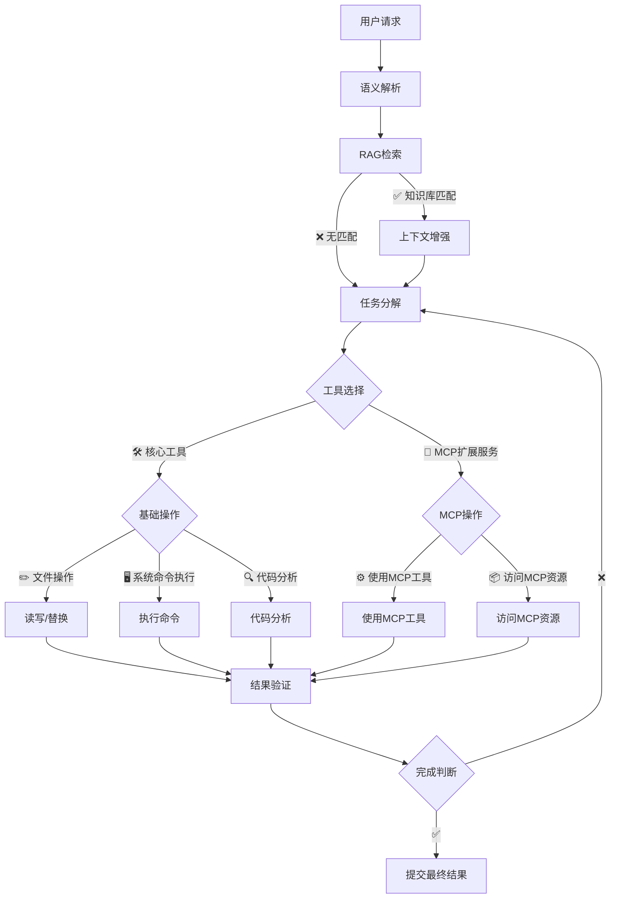

# Markdown 全格式综合测试文档

### 块级公式1

$$E = mc^2$$


### 基础表格

| 姓名 | 年龄 | 职业 | 城市 |
| --- | ---: | :--- | :---: |
| Jack | 33 | iOS Developer | 深圳 |
| Tom | 28 | Android Developer | 北京 |
| Lucy | 30 | Designer | 上海 |

### Swift

```swift
import UIKit

func render(markdown: String) {
    markdownView.render(markdown)
}
```

下面是 2025 年各季度销售额： 

```echarts
{
  "title": {
    "text": "2025 年季度销售额"
  },
  "tooltip": {
    "trigger": "axis"
  },
  "xAxis": {
    "type": "category",
    "data": ["Q1", "Q2", "Q3", "Q4"]
  },
  "yAxis": {
    "type": "value"
  },
  "series": [
    {
      "name": "销售额",
      "type": "bar",
      "data": [120, 200, 150, 280]
    }
  ]
}
```


```mermaid
flowchart LR
    A[开始] --> B[处理]
    B --> C[结束]
```


```mermaid
graph TD
    A[用户请求] --> B[语义解析]
    B --> C[RAG检索]
    
    C -->|✅ 知识库匹配| D[上下文增强]
    C -->|❌ 无匹配| E[任务分解]
    
    D --> E
    
    E --> F{工具选择}
    
    F -->|🛠️ 核心工具| G{基础操作}
    F -->|🔌 MCP扩展服务| H{MCP操作}
    
    G -->|✏️ 文件操作| I[读写/替换]
    G -->|🖥️ 系统命令执行| J[执行命令]
    G -->|🔍 代码分析| K[代码分析]
    
    H -->|⚙️ 使用MCP工具| L[使用MCP工具]
    H -->|📦 访问MCP资源| M[访问MCP资源]
    
    I --> N[结果验证]
    J --> N
    K --> N
    L --> N
    M --> N
    
    N --> O{完成判断}
    
    O -->|✅| P[提交最终结果]
    O -->|❌| E
```

