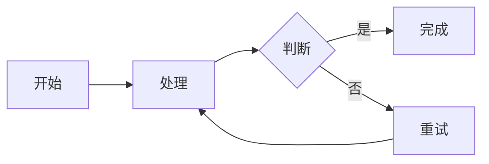

## 十三、行内代码

Swift 变量：`let name = "Jack"`

Objective-C 字符串：`NSString *name = @"Jack";`

终端命令：`flutter pub get`

调用 `viewDidLoad()` 方法完成初始化。

包含特殊字符：`a > b && c < d`

---

## 十四、代码块

### Swift

```swift
import UIKit

final class MarkdownViewController: UIViewController {

    private let markdownView = MarkdownView()

    override func viewDidLoad() {
        super.viewDidLoad()

        view.backgroundColor = .white
        view.addSubview(markdownView)
        markdownView.frame = view.bounds
    }

    func render(markdown: String) {
        markdownView.render(markdown)
    }
}
```

### Objective-C

```objectivec
#import "ViewController.h"

@implementation ViewController

- (void)viewDidLoad {
    [super viewDidLoad];
    self.view.backgroundColor = [UIColor whiteColor];
    NSLog(@"Hello, %@", @"World");
}

@end
```

### JavaScript

```javascript
const items = [1, 2, 3, 4, 5];
const total = items.reduce((acc, cur) => acc + cur, 0);

function greet(name = "World") {
  if (!name) return "Hello!";
  return `Hello, ${name}! Total is ${total}`;
}

console.log(greet("Markdown"));
```

### Python

```python
def fibonacci(n: int) -> list:
    result, a, b = [], 0, 1
    for _ in range(n):
        result.append(a)
        a, b = b, a + b
    return result


if __name__ == "__main__":
    print(fibonacci(10))
```

### JSON

```json
{
  "name": "MarkdownViewKit",
  "version": "1.0.0",
  "dependencies": {
    "Kingfisher": "^8.0.0"
  },
  "platforms": ["iOS", "macOS"],
  "enabled": true,
  "count": 42
}
```

### Shell

```bash
#!/bin/bash
set -e

cd Example
pod install --repo-update
open SwiftMarkdownViewKit.xcworkspace
```

### 无语言标识的代码块

```
这是一个没有指定语言的代码块
不会应用语法高亮
    保留    原始    缩进
```

### 缩进式代码块

    这是使用四个空格缩进的代码块
    第二行内容
    第三行内容

### 代码块中包含 Markdown 语法

```markdown
# 这是标题
**这是粗体**
- 这是列表
> 这是引用
```

### 波浪号围栏代码块

~~~swift
let message = "使用 ~~~ 作为围栏"
print(message)
~~~

---

## 十五、数学公式（LaTeX）

### 行内公式

爱因斯坦质能方程 $E = mc^2$ 是物理学的基石。

勾股定理为 $a^2 + b^2 = c^2$。

### 块级公式

$$
E = mc^2
$$

### 二次方程求根公式

$$\\frac{-b \\pm \\sqrt{b^2 - 4ac}}{2a}$$

### 高斯积分

$$\\int_{0}^{\\infty} e^{-x^2} dx = \\frac{\\sqrt{\\pi}}{2}$$

### 求和公式

$$\\sum_{i=1}^{n} x_i = \\frac{a+b}{c-d}$$

### 矩阵

$$\\begin{bmatrix} 1 & x & x^2 \\\\\\\\ 0 & 1 & 2x \\\\\\\\ 0 & 0 & 2 \\end{bmatrix}$$

### 嵌套混合

$$f(x) = \\begin{pmatrix} \\frac{1}{2} & \\sqrt{x} \\\\\\\\ \\alpha & \\beta \\end{pmatrix}$$

### 定积分

$$\\int_{a}^{b} f(x) dx$$

---

## 十六、Mermaid 图表

### 流程图（横向）




